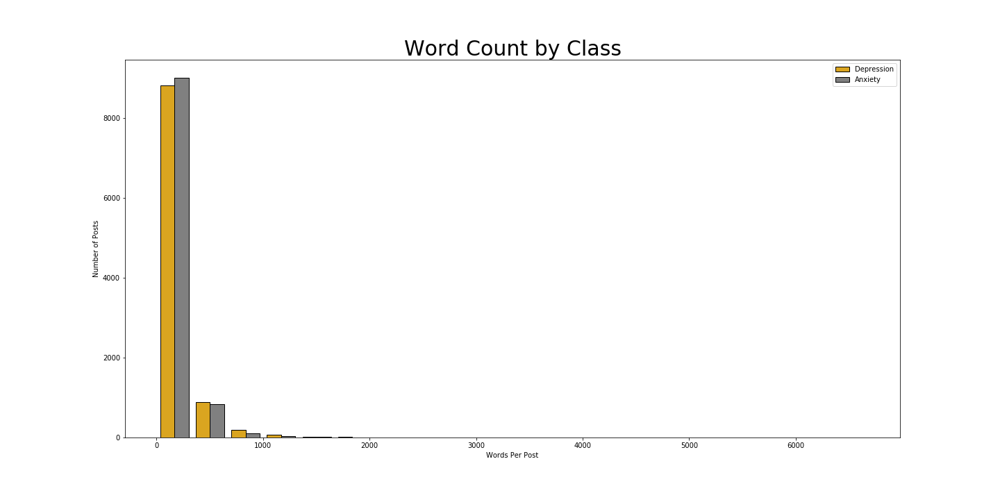
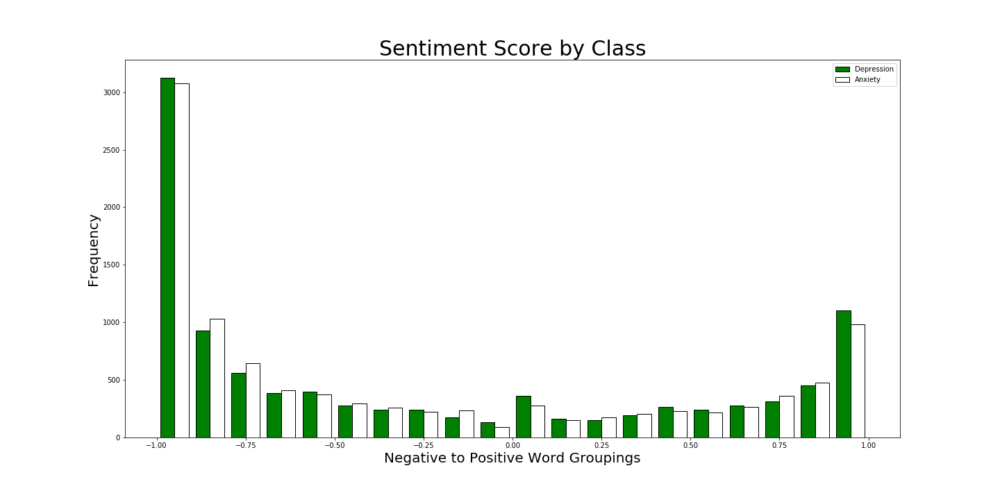
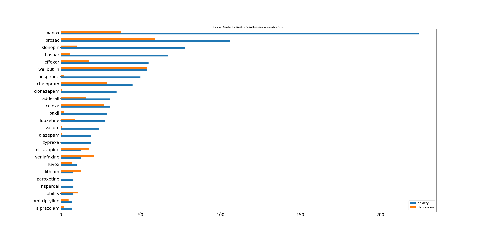
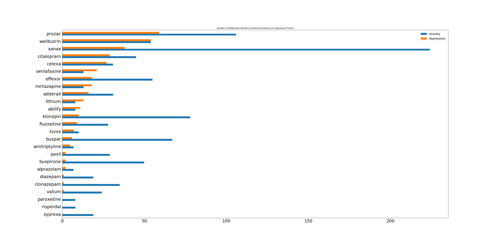

## 👨‍💻 😬 Project 3: Reddit Anxiety and Depression  😔 👩‍💻 

## Problem Statment
This project is aimed at gaining insights regarding anxiety and depression amongst different communities of Reddit users. I will be comparing the two through the lens of the mental health workers at universities in the United States. These workers are famously over-taxed the current generation of students is suffering from both anxiety and depression at alarming rates. Many of these university students are between the ages of 19 and 30. This makes Reddit a perfect environment to observe this population, as roughly 60% of the user base of Reddit is between 18 and 29. 

It is my intention to produce a model that successfully can distinguish between the depression and anxiety forums. This will be determined by similar scores between training and testing groups above 80%.

While in the forums, I would also like to make recomendations regarding medications that are being discussed between the two groups. 
 

## Data Dictionary
|Feature         |   Type |   Description |
|:--------------|----------:|-------------:|
| index       |        int |            Default index number. Describes initial dataframe order |
| title     |         str |            title of Reddit post|
| selftext    |         str |            body of Reddit post |
| created_utc        |        int |            time of initial post in epoch (timezone: universal) |
| num_comments    |        int |            number of comments at the time the post was sampled|
| subreddit    |         str |            denotes subreddit the post came from  |
| merged_text     |        str |            the title and body of post combined in one cell |
| target_sub         |        int |            binary cell: Anxiety = 1, Depression = 0 |

## Data Collection and Dataframe

Using `pushshift.io`, I scraped two similar subreddits. I wrote a function that pulled 20,000 posts, 1,000 at a time from each subreddit specified. The reason for this limitation is that 1,000 is the maximum allowed post pulls at one given time. The initial pull was collected into a list of `.json` files, so the function converted those `.json` files into a Dataframe. It then dropped any duplicates and created a `merged_text` column from the title and selftext columns. Additionally, a `target_sub` column was created to act as a binary Anxiety/Depression signifier. Anxiety = 1, Depression = 0. This column will ultimately serve as my `y` variable. I also exported the function to an external python file to be more easily called upon in the future.

### DataFrame Description
First two rows of the DataFrame for reference:

|index | title| selftext |  created_utc | num_comments | subreddit| merged_text |target_sub| |
|---:|--------:|:------------|:----|--------:|------:|:-----|:-----|-----:|
   |       0 | Anxiety tips or tricks?                                    | Anxiety tips or tricks! I get...|    1580143520 |              2 | Anxiety     | Anxiety tips or tricks? Anxiety tips or tricks!    |            1 |                                                          
   |       1 | No sleep going on a week.                                  | Lifetime sufferer of anxiety/panic...  |    1580143308 |              0 | Anxiety     | No sleep going on a week. Lifetime sufferer of anxiety/panic.  | 1| 
   
### Cleaning
Due to the nature of data collection, cleaning was a fairly minimal and straightforward process. The `.json` files converted with data loss at a minimum. There were 4 `NaN` cells in a dataframe of 20,000 rows and 6 features. Those `NaN` cells were in two rows, possibly from deleted posts, and were dropped. There were also several `HTML` artifacts. These were removed with a `.replace` function. 

### CountVectorizer
Preparation for the CountVectorizer included creating a list of 'stop words' that would be ignored because they hold little significance. I added to a default list of English stop words top words that were dead giveaways for the various forums. Examples would be words such as 'Anxiety' and 'Depression'. 

I then instantiated ran CountVectorizer on `merged_data` to transform the data. Here I used a ngram_range of (1,2). So I got both single and pairs of words.

After transforming, I was able to `train_test_split` my data into X and y test sets. 

### Logistic Regression Model

I ran a logistic regression model with `max_iter=1000`. I was pretty happy with these results, my initial training data score was `.959` and testing data score was `.823`. This means that the model got `.96%` of predictions correct on the training data but only `.82%` correct on the testing data. The cross_val_score came out to `.82`. This means that the model is overfit, but still somewhat accurate. If it is misclassifying nearly `20%` of posts, however - it might be worth tweaking further. 

### K Nearest Neighbors
I wanted and additional model to contrast the LogReg results with. I took the split data and again applied it to the instantiated KNeighbors Classifier with `n_neighbors = 3`. The results were significantly worse than Logistic regression. My training and testing set scores were `.803` and .`642` respectively. Oddly this was both higher variance AND higher bias than the LogReg model. 

## Additional Observations

### Word counts

I wanted to take a look at the words used in each post as posts in both forums seemed to come in one of two flavors. They were either extraodinarily verbose or very short. Many of the short posts (under 1000 words) contained a meme or picture with limited commentary. Some shorter posts also contained links to external sites. As such, the majority of posts are under 1000 words. 

To get an idea of the verbosity of these posts, please refer to the graph below: 

### Sentiment
I wanted to further explore the data independent of the models and see what other info was available. 

I used SentimentIntensityAnalyzer to see what posts are utilizing more positive or negative words. From here I was able to compare sentiments from titles and body text with combined sentiments analysis. The findings are illustrated in the graph below:

What's interesting is that, while depression and anxiety forums tend to trend negative, around `30%` of posts had positive scores. This represents the presence of the support community that exists within these forums. While the sentiment score isn't perfect, it tends to be imperfect both negatively and positively in equal measure. After reviewing a small sampling of posts. I'm confident in declaring that this is close to an accurate representation. 

### Medications
I was also interested in the medication psychotropic medications that were being discussed in these forums. I created a list of 85 medications brand and generic names and ran a search for them in the two forums. 

Some of the more interesting insights came from the prevalence of certain medication discussions in either the depression or anxiety forums. Though I have modeled this information, the attached chart is a complete description of the combined mentions per forum.

|               |   anxiety |   depression |
|:--------------|----------:|-------------:|
| zyprexa       |        19 |            0 |
| risperdal     |         8 |            0 |
| paroxetine    |         8 |            0 |
| valium        |        24 |            1 |
| clonazepam    |        35 |            1 |
| diazepam      |        19 |            1 |
| alprazolam    |         7 |            2 |
| buspirone     |        50 |            2 |
| paxil         |        29 |            2 |
| amitriptyline |         7 |            5 |
| buspar        |        67 |            6 |
| luvox         |        10 |            7 |
| fluoxetine    |        28 |            9 |
| klonopin      |        78 |           10 |
| abilify       |         8 |           11 |
| lithium       |         8 |           13 |
| adderall      |        31 |           16 |
| mirtazapine   |        13 |           18 |
| effexor       |        55 |           18 |
| venlafaxine   |        13 |           21 |
| celexa        |        31 |           27 |
| citalopram    |        45 |           29 |
| xanax         |       224 |           38 |
| wellbutrin    |        54 |           54 |
| prozac        |       106 |           59 |

To make it easier to visualize, here is a visualization of the discussion of medication sorted by anxiety posts:

And again sorted by depression posts: 

It is interesting to note that Anxiety posts seem to discuss medications much more frequently. Perhaps this points to the trend of people who post in r/Anxiety encounter medications more frequently than posters in r/Depression. This could point to depression posters being undermedicated, or, perhaps anxiety posters being disproportionately overmedicated.

### Conclusion

Without further modification to the models, K Nearest Neighbors is far inferior to Logistic Regression at spotting the difference between these forums. It would be interesting to run other models including a Naive Bayes model in the future. It would be interesting, given more time to give CountVectorizer a much greater range and see how that affects the models. 

I was happy to see that there were such a high number of positive posts in the forums, despite the rather morose subject matter discussed therein. 

I would be curious to dig further into the medication distribution among the two forums. I would like to see how many anxiety medications are being discussed in the depression forums and vice versa.